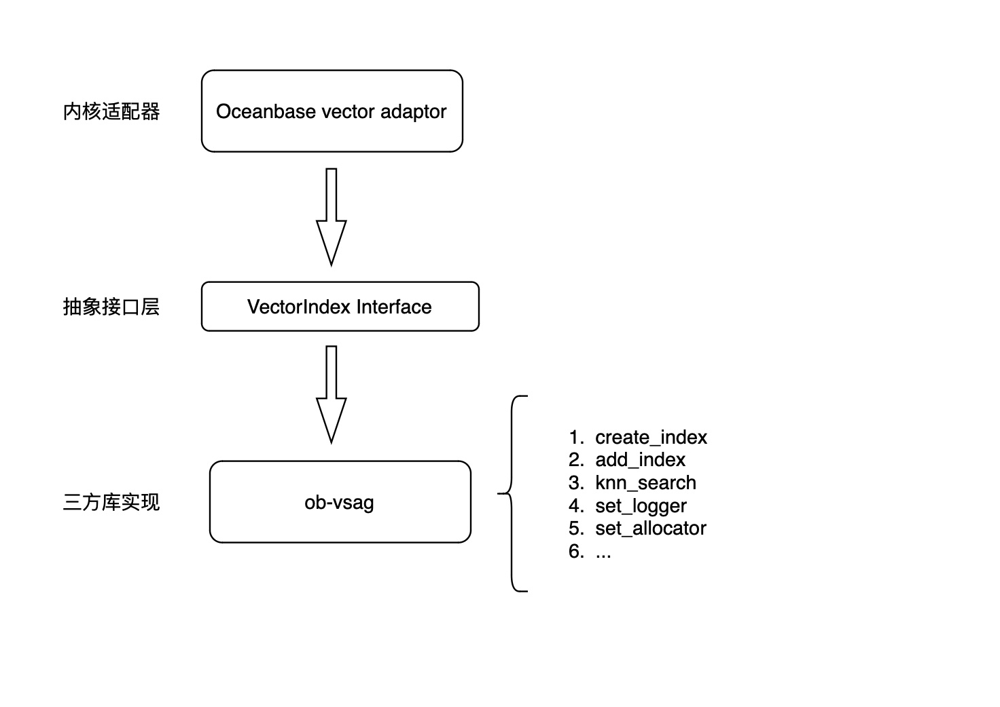

# ob-vsag

<div align="left">

[]()

</div>

ob-vsag is built by the [OceanBase](https://github.com/oceanbase/oceanbase) team based on Ant Group's [vsag](https://github.com/alipay/vsag). VSAG is a vector indexing library written in C++ specifically designed for similarity search. This index algorithm library provides methods to generate parameters based on vector dimensions and data scale, enabling users to search vector datasets of different scales. Developers can integrate and use it without understanding the specific principles of the algorithm.

## Getting started
gcc9 and cmake-3.22 are required
```
#after clone this project
cd ob-vsag
cmake .
make -j

#after build success,run test example to check
cd example
./hnsw_example
```
- More details refs to [vsag](https://github.com/alipay/vsag)

## Architecture

The relationship between ob-vsag and the overall OceanBase architecture is shown in the diagram below. The OceanBase kernel provides a set of vector retrieval abstract interfaces when implementing vector retrieval functions. ob-vsag is an adaptation layer encapsulated based on vsag:



# Contributing

We warmly welcome every developer who loves database technology and look forward to embarking on a journey of ideas collision with you. Whether it's formatting and text corrections, bug fixes, or adding new features, these are all ways to participate and contribute.

# License

ob-vsag is licensed under the Apache 2.0 open source license
